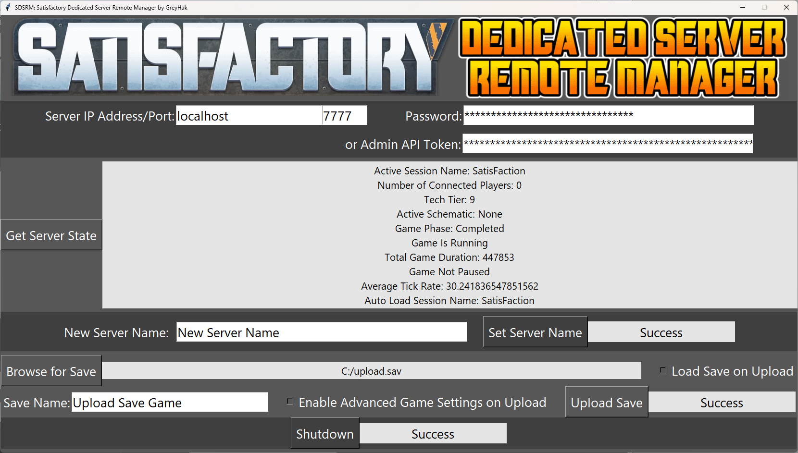

# SDSRM: Satisfactory Dedicated Server Remote Manager by GreyHak

This is a remote server manager for Satisfactory 1.0's Dedicated Server which
implements the server's HTTPS API.
Tested on v1.0.0.3, server build 15811013.

[Satisfactory](https://www.satisfactorygame.com/) is a non-competitive,
first-person, open-world, factory-building and exploration game produced by
[Coffee Stain Studios](https://www.coffeestain.com/).

This API implementation is based on the documentation Coffee Stain Studios
releases with the game.  Windows users can find it at:
`C:\Program Files (x86)\Steam\steamapps\common\Satisfactory\CommunityResources\DedicatedServerAPIDocs.md`

Currently supported features:
 - User and Administrator Login and Login Verification
 - Get Server Status
 - Set Server Name
 - Upload Save
	 - Load save on upload
	 - Enable advanced game settings on upload

This server manager works on **Windows** and **Linux**.  It requires
**Python3**.  It has been tested with Python 3.7+ on Windows 11 and Ubuntu
22.04.3 LTS.  On Linux it requires python3 with tkinter which is not installed
in the minimal python3 install.  To install python3 with tkinter on
Ubuntu/Debian, run `sudo apt install python3-tk` or the variant for your
version of python such as `sudo apt install python3.13-tk`.

## SDSRM Remote Server Manager GUI

On Windows, double-click sdsrm_gui.py or run `py sdsrm_gui.py` from the
command line.

On Linux, run `python3 sdsrm_gui.py` or the variant for your version of python
such as `python3.13 sdsrm_gui.py`.

## SDSRM Remote Server Manager Library

If you would like to integrate SDSRM into your own project, SDSRM's interface
to the Satisfactory's Dedicated Server API is separate from SDSRM's GUI.  Copy
*sdsrm_lib.py* into your project and import it `import sdsrm_lib`.

This library provides the following interfaces:
 - (getStatus, serverStatus) = sdsrm_lib.getServerState(hostname, port, authorizationCode)
 - setStatus = sdsrm_lib.setServerName(hostname, port, authorizationCode, newName)
 - uploadStatus = sdsrm_lib.uploadSave(hostname, port, authorizationCode, filepath, saveName, loadCheckFlag, advancedCheckFlag)

## Credits
 - Credit to [Nate Wren](https://natewren.com/satisfontory/) for the font used
in the SDSRM logo.
 - Thanks to [textstudio.com](https://www.textstudio.com/logo/gradient-color-text-137)
for generation of the SDSRM logo.
